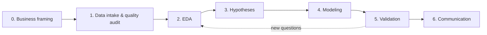

# Methodology — AI-Assisted Data Analytics

A phased lifecycle for analytics projects, adapted from CRISP-DM and tuned for
AI-assisted work. Designed to be **reusable**: this document and its standards are
project-agnostic; project-specific state lives in `docs/ROADMAP.md`, `docs/HYPOTHESES.md`,
and `docs/decisions/`.

## Why a formal methodology (and why this one)

| Approach | Pros | Cons | Verdict |
|---|---|---|---|
| Ad-hoc notebook exploration | Fast start, low ceremony | Irreproducible, silent data decisions, leakage risk, hard to review | Rejected |
| Full CRISP-DM / TDSP | Battle-tested, complete | Heavy for small teams and time-boxed cases | Base, slimmed down |
| **This: phased CRISP-DM + registries (hypotheses, decisions, AI log)** | Auditable, right-sized, AI-review-friendly | Small documentation overhead per phase | **Adopted** (see DR-0001) |

The overhead is deliberate and bounded: each phase produces at most 1–2 short artifacts.
The payoff is that any reviewer — human or AI — can reconstruct *why* every number exists.

## The lifecycle

Phases can iterate (validation frequently sends you back to EDA), but **artifacts are
never skipped** — a phase is complete only when its exit criteria hold.

### Phase 0 — Business framing

Translate the business ask into analytical questions with success criteria.

- **Entry**: a business problem or case statement.
- **Activities**: identify decisions the analysis must support, the audiences, the
  constraints (time, data, scope), and what "good enough" means for each question.
- **Exit criteria**: questions written as decisions ("choose reorder quantities for Q3"),
  success metrics agreed, scope explicitly bounded (what we will *not* do).
- **Artifacts**: framing section in `ROADMAP.md`; scope decisions in `docs/decisions/`.

> **Artifact convention.** Analysis code is scripts, not notebooks ([DR-0003](../decisions/DR-0003-scripts-over-notebooks.md)):
> logic lives in `src/analysis/`, each lifecycle stage has a runnable entry point in
> `scripts/NN_*.py`, and **every stage writes a markdown artifact plus figures into
> `reports/`** — so results are readable and reviewable without re-running the pipeline.

### Phase 1 — Data intake & quality audit

Understand and audit the data before believing anything it says.
Standard: [01-data-intake-and-quality.md](01-data-intake-and-quality.md).

- **Exit criteria**: grain verified, dictionary confirmed against reality, quality issues
  quantified, cleaning rules decided and logged with row counts.
- **Artifacts**: `scripts/01_data_audit.py` → `reports/01_data_quality.md` (including the
  cleaning decision log); processed panel in `data/processed/`.

### Phase 2 — Exploratory data analysis

Structured exploration that ends in findings, not just plots.
Standard: [02-eda-standard.md](02-eda-standard.md).

- **Exit criteria**: the phenomena relevant to each business question are characterized
  (levels, trends, seasonality, promo behavior, segments); each finding is stated as a
  sentence with evidence.
- **Artifacts**: `scripts/02_eda.py` → `reports/02_eda.md` + `reports/figures/`; findings
  logged in `FINDINGS.md`, candidate hypotheses pushed to `HYPOTHESES.md`.

### Phase 3 — Hypotheses

Convert findings and business intuitions into testable statements.
Standard: [03-hypothesis-protocol.md](03-hypothesis-protocol.md).

- **Exit criteria**: each hypothesis has a falsifiable statement, a test plan, and a priority.
- **Artifacts**: entries in `docs/HYPOTHESES.md`.

### Phase 4 — Modeling

Baseline-first modeling with explicit trade-offs.
Standard: [04-modeling-standards.md](04-modeling-standards.md).

- **Exit criteria**: baseline established; candidate models compared on the same temporal
  splits; final choice justified in a decision record.
- **Artifacts**: `scripts/03_forecast.py`, `04_elasticity.py`, `05_uplift.py` → one report
  each in `reports/`; decision records for model, grain and metric choices.

### Phase 5 — Validation

Stress the results before anyone acts on them.

- **Activities**: temporal out-of-sample evaluation, sensitivity to cleaning rules and
  assumptions, sanity checks against business reality (magnitudes, signs, known events),
  explicit listing of limitations and failure modes.
- **Exit criteria**: results reproduce end-to-end from raw data; limitations documented;
  hypotheses updated with verdicts.
- **Artifacts**: validation section per model, updated hypothesis registry.

### Phase 6 — Communication

Deliver for both audiences.
Standard: [06-communication.md](06-communication.md).

- **Exit criteria**: technical deliverable reproduces; business deliverable is
  jargon-free, actionable, and honest about uncertainty.
- **Artifacts**: final report(s) in `reports/`.

## Cross-cutting standards

- [05-ai-collaboration.md](05-ai-collaboration.md) — how AI assistants participate in every phase.
- [07-traceability-and-logging.md](07-traceability-and-logging.md) — the four registries
  (`FINDINGS.md`, `HYPOTHESES.md`, `decisions/`, `WORKLOG.md`), what deserves an entry, and
  the rules that keep the trail honest.

## Reusing this methodology in a new project

1. Copy `docs/methodology/`, `docs/decisions/DR-0000-template.md`, and the empty registries
   (`FINDINGS.md`, `HYPOTHESES.md`, `WORKLOG.md`, `AI_USAGE_LOG.md`, `ROADMAP.md` skeleton).
2. Copy `CLAUDE.md` and rewrite the project-specific sections (What/Data/Where); keep the
   non-negotiable working rules.
3. Copy the `src/analysis/` + `scripts/` skeleton; replace the domain modules, keep
   `config.py`, the reporting helpers, and the stage-artifact convention.
4. Run Phase 0 and record the framing in the new `ROADMAP.md`.

DR-0001 through DR-0003 are project-agnostic and can be carried over as-is; renumber
subsequent records from DR-0004.
