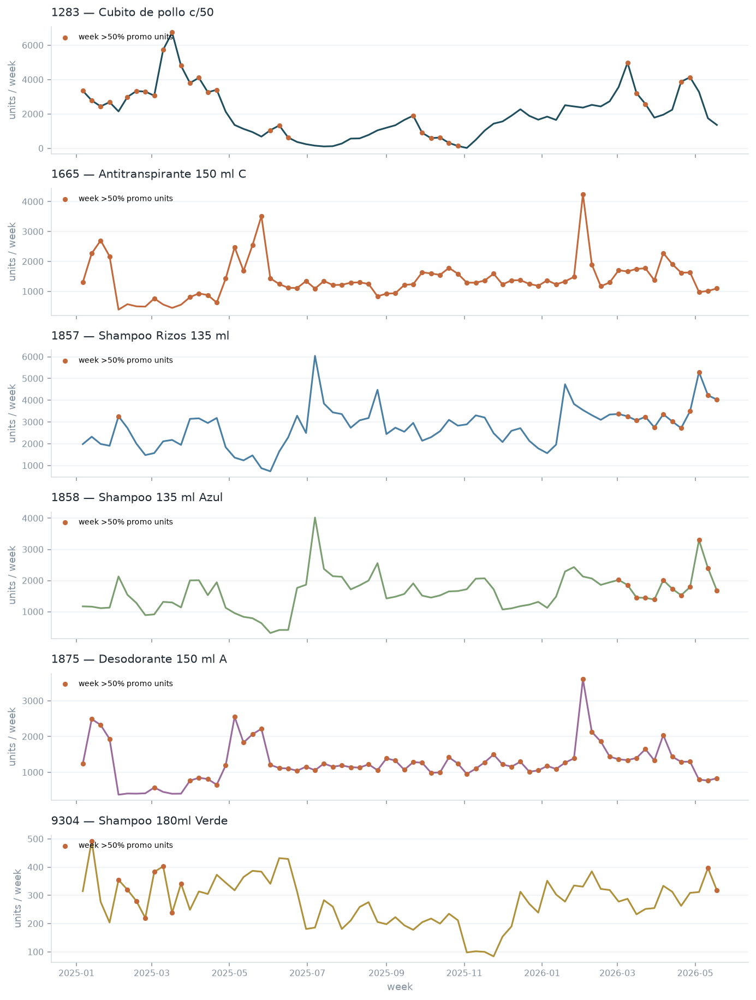
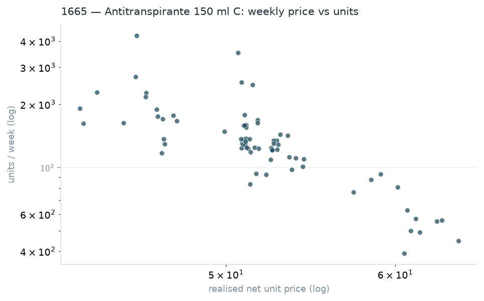
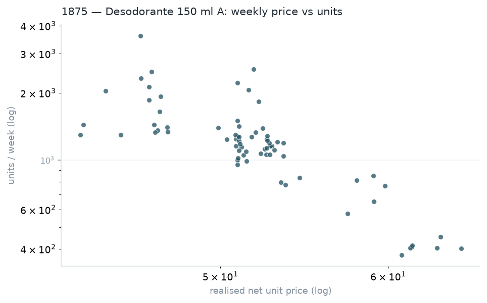
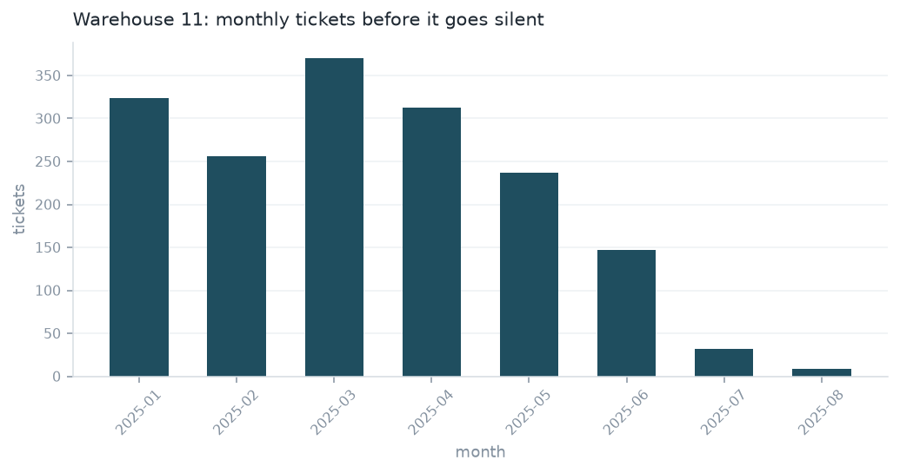
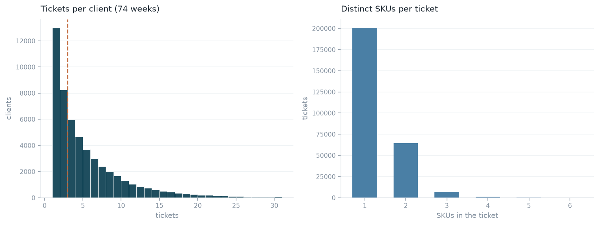
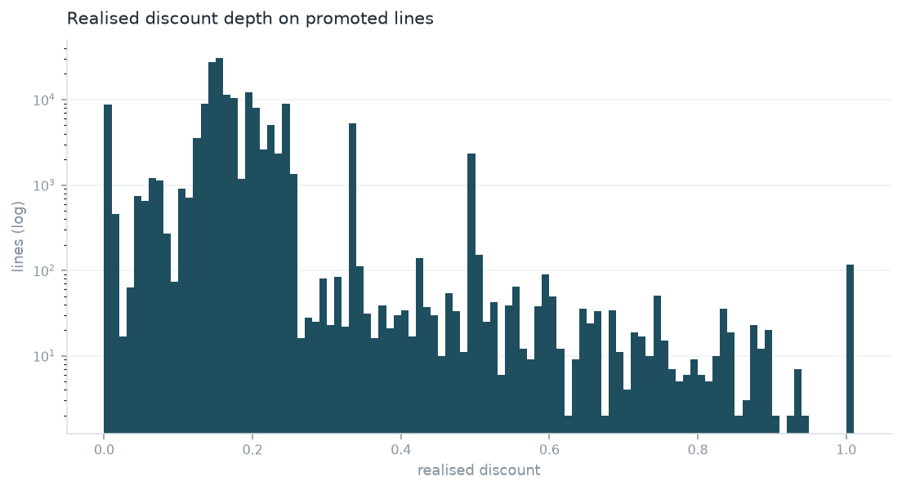
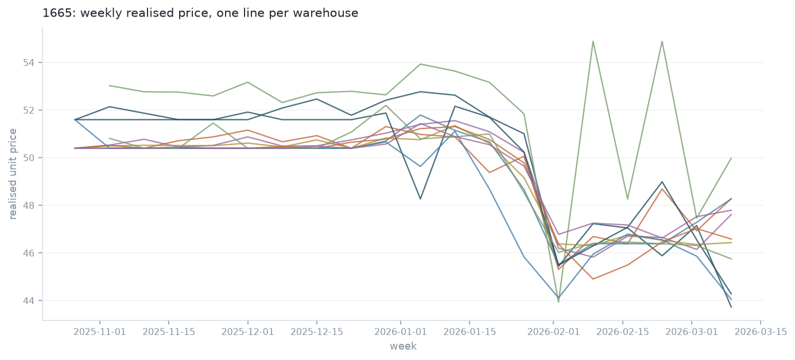

# Stage 02 — Cleaning, weekly panel and EDA

> **Generated artifact — do not edit by hand.** Produced by `scripts/02_eda.py`; re-run the script to regenerate.

Cleaning decisions applied as flags, the weekly SKU panel the three challenges share, and the exploration that selects SKUs and promotions.

| Run metadata | Value |
|---|---|
| Stage | `scripts/02_eda.py` |
| Generated (UTC) | 2026-08-05 00:43:16 |
| Source file | `20260701_Prueba_tecnica_AI Engineer.csv` |
| Source SHA-256 | `a8a9b8a3d5c91955…` |
| Param · nrows | all |

## 1. Cleaning decision log

Each rule adds a boolean column; nothing is deleted. Downstream stages pick a selector, so every exclusion stays visible and reversible (standard 01).

| flag | rule | rows | rows_% | units | rationale |
|---|---|---|---|---|---|
| is_zero_quantity | sell_in_quantity <= 0 | 515 | 0.144 | 0 | No units moved, so the row carries no demand signal. Kept for revenue reconciliation but excluded from any units-based model. |
| is_zero_amount | sell_in_amount <= 0 while units moved | 593 | 0.165 | 4,291 | Units shipped at no charge — free goods or a fully-discounted combo leg. Real demand, so kept for forecasting; excluded from price work because a zero realised price is not a point on a demand curve. |
| is_missing_money | bruto or product_cost is null | 107 | 0.03 | 0 | Cannot compute list price or margin. Excluded from elasticity; harmless for unit forecasting. |
| is_incomplete_metadata | category, brand or basket is null | 1 | 0 | 0 | The record the case statement warns about (F-005). Isolated rather than deleted so its footprint stays visible. |
| is_negative_discount | discount < 0 | 10,084 | 2.811 | 2.298e+04 | A negative discount is a surcharge, which the dictionary does not describe (F-004, open question Q6). Excluded from price work pending an answer; the units are still real, so they stay in the demand panel. |
| is_promo | id_combo is not null | 189,282 | 52.76 | 3.165e+05 | Not a defect — the promo marker every challenge depends on. |
| usable_for_demand | derived selector | 358,260 | 99.86 | 6.844e+05 | Rows entering the demand panel. |
| usable_for_price | derived selector | 347,660 | 96.9 | 6.577e+05 | Rows entering price/elasticity work. |

> Zero-amount rows keep their units: shipping stock at no charge is still demand, and dropping it would bias a units forecast downwards. They are excluded from price work instead, because a realised price of zero is not a point on a demand curve.

## 2. The weekly SKU panel

| Item | Value |
|---|---|
| SKU-weeks (all) | 444 |
| SKU-weeks (complete weeks only) | 432 |
| Partial weeks excluded from modelling | 2 |
| First complete week | 2025-01-06 |
| Last complete week | 2026-05-18 |
| Complete weeks per SKU | 72 |

> The first and last calendar weeks are truncated by the extract boundaries. They are flagged rather than dropped, because a truncated week looks like a demand collapse to any model that sees it — and like a real data point to any reader who does not know it was cut.

## 3. Volume and price structure per SKU

| product_code | product_name | weeks | total_units | median_weekly_units | cv_weekly_units | median_price | price_p10 | price_p90 | median_promo_share | price_spread_p90/p10 |
|---|---|---|---|---|---|---|---|---|---|---|
| 1283 | Cubito de pollo c/50 | 72 | 1.458e+05 | 1,869 | 0.701 | 196.1 | 175.2 | 201.2 | 0.3496 | 1.15 |
| 1665 | Antitranspirante 150 ml C | 72 | 1.008e+05 | 1,302 | 0.462 | 51.32 | 45.92 | 60.52 | 0.9251 | 1.32 |
| 1857 | Shampoo Rizos 135 ml | 72 | 1.995e+05 | 2,747 | 0.343 | 19.71 | 19.46 | 20.87 | 0 | 1.07 |
| 1858 | Shampoo 135 ml Azul | 72 | 1.16e+05 | 1,556 | 0.378 | 19.7 | 19.6 | 20.87 | 0 | 1.06 |
| 1875 | Desodorante 150 ml A | 72 | 9.033e+04 | 1,202 | 0.445 | 51.51 | 46.28 | 59.71 | 0.9281 | 1.29 |
| 9304 | Shampoo 180ml Verde | 72 | 2.002e+04 | 279 | 0.3 | 17.24 | 15.84 | 17.28 | 0.07191 | 1.09 |

> `cv_weekly_units` (coefficient of variation) is the forecastability signal: a low value means a naive baseline will already be hard to beat. `price_spread_p90/p10` is the elasticity signal — a SKU whose weekly price barely moves cannot identify a price response (**H-004**).

*Weekly units per SKU across the 74-week history. Promo-dominated weeks are marked; the level shifts they produce are what Challenge C must separate from underlying demand.*

## 4. Promotion calendar

| Item | Value |
|---|---|
| Distinct combos | 110 |
| Combos above the materiality floor (500 units) | 63 |
| Units sold under a combo | 3.165e+05 |
| Median combo duration (days) | 30 |

The largest promotions by volume — Challenge C's candidate pool:

| id_combo | combo | product_code | first_date | last_date | duration_days | weeks | units | discount_depth | warehouses |
|---|---|---|---|---|---|---|---|---|---|
| 9810 | combo n. 38 | 1875 | 2025-04-11 00:00:00 | 2026-02-10 00:00:00 | 306 | 28 | 2.904e+04 | 0.1463 | 12 |
| 9810 | combo n. 38 | 1665 | 2025-04-11 00:00:00 | 2026-02-10 00:00:00 | 306 | 28 | 2.814e+04 | 0.1529 | 12 |
| 10400 | combo n. 21 | 1665 | 2025-10-01 00:00:00 | 2026-02-02 00:00:00 | 125 | 19 | 2.321e+04 | 0.1609 | 11 |
| 10400 | combo n. 21 | 1875 | 2025-10-01 00:00:00 | 2026-02-02 00:00:00 | 125 | 19 | 1.934e+04 | 0.161 | 11 |
| 11115 | combo n. 33 | 1857 | 2026-05-01 00:00:00 | 2026-05-30 00:00:00 | 30 | 5 | 1.657e+04 | 0 | 11 |
| 9728 | combo n. 71 | 1283 | 2025-03-14 00:00:00 | 2025-04-28 00:00:00 | 46 | 8 | 1.603e+04 | 0.001426 | 12 |
| 10856 | combo n. 41 | 1857 | 2026-03-02 00:00:00 | 2026-03-31 00:00:00 | 30 | 5 | 1.196e+04 | 0 | 11 |
| 8724 | combo n. 43 | 1283 | 2025-01-15 00:00:00 | 2026-05-12 00:00:00 | 483 | 18 | 1.099e+04 | -0.0001776 | 11 |
| 10811 | combo n. 56 | 1875 | 2026-02-11 00:00:00 | 2026-04-01 00:00:00 | 50 | 8 | 9,587 | 0.147 | 11 |
| 10811 | combo n. 56 | 1665 | 2026-02-11 00:00:00 | 2026-04-01 00:00:00 | 50 | 8 | 9,157 | 0.1611 | 11 |
| 11115 | combo n. 33 | 1858 | 2026-05-01 00:00:00 | 2026-05-30 00:00:00 | 30 | 5 | 8,645 | 0 | 11 |
| 2902 | combo n. 61 | 1283 | 2025-01-04 00:00:00 | 2025-03-31 00:00:00 | 87 | 12 | 6,662 | 0.1974 | 12 |

> A combo's `discount_depth` here is realised (1 − net/gross), not the nominal offer. Candidates for uplift estimation need enough duration to see a before and an after, and enough volume for the effect to clear week-to-week noise.

## 5. Seasonality and trend

Median weekly units by calendar month, per SKU:

| product_code | 1 | 2 | 3 | 4 | 5 | 6 | 7 | 8 | 9 | 10 | 11 | 12 |
|---|---|---|---|---|---|---|---|---|---|---|---|---|
| 1283 | 2,477 | 2,636 | 3,687 | 3,338 | 1,361 | 630 | 142 | 680 | 1,345 | 454 | 764 | 1,891 |
| 1665 | 1,428 | 872 | 1,090 | 1,526 | 1,689 | 1,244 | 1,216 | 1,270 | 1,216 | 1,595 | 1,328 | 1,248 |
| 1857 | 1,989 | 3,183 | 2,913 | 3,099 | 1,467 | 2,298 | 3,646 | 3,131 | 2,554 | 2,706 | 3,050 | 2,134 |
| 1858 | 1,166 | 1,902 | 1,416 | 1,764 | 954 | 413 | 2,256 | 1,922 | 1,515 | 1,586 | 1,890 | 1,177 |
| 1875 | 1,331 | 927 | 1,050 | 1,245 | 1,832 | 1,120 | 1,175 | 1,138 | 1,287 | 1,122 | 1,191 | 1,159 |
| 9304 | 309 | 322 | 266 | 314 | 365 | 341 | 223 | 235 | 198 | 215 | 99 | 239 |

> Read for shape, not level. A flat row means a seasonal-naive baseline has nothing to exploit and a moving average will be the one to beat (**H-003**).

## 6. Price–quantity relationship (Challenge B precondition)

*1665 (Antitranspirante 150 ml C): weekly realised price against units, both on log scales. Correlation -0.68 — a downward slope is the precondition for an elasticity estimate, not proof of one.*

*1875 (Desodorante 150 ml A): weekly realised price against units, both on log scales. Correlation -0.71 — a downward slope is the precondition for an elasticity estimate, not proof of one.*

## 7. Warehouse network

The forecast is national and allocation splits it by warehouse share (stage 06). Before treating warehouses as one interchangeable dimension of the same demand, it is worth checking whether they are: a warehouse selling a lot to few clients is a different commercial relationship than one selling little to many, even at the same revenue.

| warehouse | routes | clients | revenue | revenue_per_client | revenue_share | top_product_code | top_product_name |
|---|---|---|---|---|---|---|---|
| bodega n. 6 | 72 | 15,562 | 1.023e+07 | 657.5 | 0.2283 | 1283 | Cubito de pollo c/50 |
| bodega n. 3 | 17 | 5,051 | 9.517e+06 | 1,884 | 0.2124 | 1283 | Cubito de pollo c/50 |
| bodega n. 9 | 25 | 6,090 | 5.777e+06 | 948.7 | 0.1289 | 1283 | Cubito de pollo c/50 |
| bodega n. 2 | 8 | 2,869 | 4.027e+06 | 1,404 | 0.0899 | 1283 | Cubito de pollo c/50 |
| bodega n. 4 | 15 | 3,897 | 3.626e+06 | 930.4 | 0.0809 | 1283 | Cubito de pollo c/50 |
| bodega n. 12 | 10 | 3,149 | 2.734e+06 | 868.2 | 0.061 | 1283 | Cubito de pollo c/50 |
| bodega n. 10 | 9 | 2,599 | 2.343e+06 | 901.6 | 0.0523 | 1283 | Cubito de pollo c/50 |
| bodega n. 5 | 9 | 2,820 | 2.118e+06 | 751.2 | 0.0473 | 1283 | Cubito de pollo c/50 |
| bodega n. 8 | 29 | 4,674 | 1.396e+06 | 298.7 | 0.0311 | 1283 | Cubito de pollo c/50 |
| bodega n. 7 | 18 | 2,709 | 1.388e+06 | 512.3 | 0.031 | 1283 | Cubito de pollo c/50 |
| bodega n. 1 | 7 | 2,201 | 1.357e+06 | 616.3 | 0.0303 | 1283 | Cubito de pollo c/50 |
| bodega n. 11 | 9 | 934 | 3.016e+05 | 322.9 | 0.0067 | 1283 | Cubito de pollo c/50 |

| Item | Value |
|---|---|
| Warehouses | 12 |
| Routes | 228 |
| Clients | 52,555 |
| Revenue share, top 2 warehouses | 0.4407 |
| Revenue share, top 5 warehouses | 0.7403 |
| Same top product in every warehouse | 1 |

*Revenue concentrates hard — the top 2 warehouses hold 44% of revenue, the top 5 hold 74% — but revenue per client separates them further: some warehouses reach many clients at low value each, others reach few at high value each, which a single revenue ranking hides.*

> **F-012.** 1283 (Cubito de pollo c/50) is the top-revenue product in all 12 warehouses, and revenue is far more concentrated than clients or routes (44% of revenue in 2 of 12 warehouses). Warehouses differ in kind, not just in scale, which is the caveat any warehouse-level allocation or model has to carry.

## 8. Warehouse 11 shutdown — a structural break inside the training window

| warehouse | last_sale_date |
|---|---|
| bodega n. 11 | 2025-08-28 |
| bodega n. 2 | 2026-05-29 |
| bodega n. 8 | 2026-05-29 |
| bodega n. 1 | 2026-05-30 |
| bodega n. 10 | 2026-05-30 |
| bodega n. 12 | 2026-05-30 |
| bodega n. 3 | 2026-05-30 |
| bodega n. 4 | 2026-05-30 |
| bodega n. 5 | 2026-05-30 |
| bodega n. 6 | 2026-05-30 |
| bodega n. 7 | 2026-05-30 |
| bodega n. 9 | 2026-05-30 |

| month | tickets |
|---|---|
| 2025-01 | 324 |
| 2025-02 | 256 |
| 2025-03 | 370 |
| 2025-04 | 313 |
| 2025-05 | 237 |
| 2025-06 | 147 |
| 2025-07 | 32 |
| 2025-08 | 9 |

*Warehouse 11 tapers over 8 months — 324 tickets in its first month down to 9 in its last (2025-08-28) — then nothing through the remaining 74-week history. A gradual wind-down, not a truncated extract.*

> **F-013.** Every other warehouse sells through the last observed week (2026-05-30); only warehouse 11 stops, on 2025-08-28, well inside the training window Challenge A forecasts over. A model that does not know this reads the taper as a demand collapse rather than an operational exit. This belongs in stage 03's forecast caveats as a structural break, and it is why stage 06 already excludes warehouse 11 from the allocation share base rather than projecting a dead warehouse's history forward.

## 9. Customer base

| Item | Value |
|---|---|
| Clients | 5.256e+04 |
| Median tickets per client (74 weeks) | 3 |
| p90 tickets per client | 12 |
| Share of clients with 3 or fewer tickets | 0.5183 |
| Tickets | 2.738e+05 |
| Median distinct SKUs per ticket | 1 |
| Tickets with exactly one SKU | 2.008e+05 |
| Share of tickets with exactly one SKU | 0.7336 |

*Half of clients bought 3 times or fewer across the 74-week history, and 73% of tickets (200,832 of 273,778) carry a single SKU — a typical customer is a thin, infrequent signal, not a panel a promotion can be read against one customer at a time.*

> **F-014.** With a median customer this thin, a per-customer uplift estimate would be mostly noise. Every uplift estimate in stage 05 is read at the network level — aggregate weekly units — for exactly this reason: promotional uplift is a property of the market a promotion runs in, not of any one customer's behaviour.

## 10. Discount structure

The weekly panel's `discount_depth` (built from `bruto` versus `sell_in_amount`) is blind to combo-level discounts that never reach `bruto` line by line — on combo 9590, `bruto == sell_in_amount` on 99.6% of 1,367 lines while `discount` reads a constant 0.2. The delivered `discount` column is used here instead, restricted to promoted, non-zero-quantity lines with usable money fields and no negative-discount surcharge — `economics.promo_discount_mask`, the same predicate `economics.mean_promo_discount` uses, imported here rather than copied so the two cannot drift apart (its docstring explains why `is_zero_amount` is deliberately not part of it: a 100%-off free-goods line is a real, informative promotional-depth observation).

| discount | lines |
|---|---|
| 0.14 | 26,972 |
| 0.16 | 26,593 |
| 0.15 | 14,856 |
| 0.17 | 14,034 |
| 0.2 | 12,397 |
| 0.25 | 9,782 |
| 0 | 8,694 |
| 0.22 | 6,640 |
| 0.13 | 5,891 |
| 0.19 | 5,420 |
| 0.33 | 5,264 |
| 0.21 | 4,052 |

| Item | Value |
|---|---|
| Promoted, price-usable lines with a discount value | 158,941 |
| Distinct discount values observed | 1,465 |
| Lines at exactly 100% discount | 118 |
| Share of those with zero net amount (bonus product) | 100% |
| Units given away at 100% discount | 811 |

*Realised discount clusters on discrete levels around 0.14-0.20 rather than a continuum, plus a separate spike at 1.0 (118 lines, 811 units) that is free product, not a price cut.*

| Item | Value |
|---|---|
| Clients with 10+ discounted lines | 3,248 |
| Median within-client std of discount depth | 0.0566 |
| Std of client-level mean discount (between clients) | 0.0332 |
| Std of discount depth, all promoted lines pooled | 0.0873 |
| Variance in discount explained by client (R²) | 0.1361 |
| Variance in discount explained by combo (R²) | 0.522 |

| min_discounted_lines | eligible_clients | client_r2 |
|---|---|---|
| 5 | 11,610 | 0.202 |
| 10 | 3,248 | 0.1361 |
| 20 | 413 | 0.087 |
| 50 | 3 | 0.0181 |

> **F-015.** 'Near zero' is the wrong bar in absolute terms — a median eligible client still shows a 0.057 spread in the depth of the promotions they happen to be offered. The test that actually speaks to client-specificity is variance explained: grouping the same lines by `id_combo` explains 52.2% of the variation in discount depth; grouping by `client_code` explains only 13.6%. If discount were negotiated per customer, client would explain most of the variation and clients would cluster tightly around their own personal rate (low within-client spread, high between-client spread) — instead the spread of client averages (std 0.033) is *smaller* than a typical client's own spread across their purchases (std 0.057). This client R² is sensitive to the minimum-lines threshold — it runs from 1.8% at a 50-line cutoff to 20.2% at a 5-line cutoff — but the direction never flips: combo always explains several times more variance than client. Together with the discrete levels and the bonus group above, this reads as a centrally-set, network-wide decision with a modest, not negligible, client effect — not a per-customer negotiation.

## 11. No control group across warehouses

Difference-in-differences needs some warehouses left untreated while others are promoted, so the untreated ones can serve as a counterfactual. Stage 05 uses other SKUs as its control instead of other warehouses; whether a warehouse-level control was ever available is an empirical question, checked here rather than assumed.

*In the week of 2026-02-02, 10 of the 11 then-active warehouses drop price by 5% or more in the same week — the move is simultaneous across the network, not staggered market by market.*

| Item | Value |
|---|---|
| Warehouses dropping price >=5% in the sync week | 10 |
| Warehouses dropping price >=3% in the sync week | 11 |
| Then-active warehouses | 11 |

> **F-016.** No warehouse was left untreated while others moved on this SKU in this window: at a 3% cutoff, all 11 then-active warehouses move together in the sync week; at 5%, one (bodega n. 7) falls just short. This rules out a warehouse-level difference-in-differences design for **this promotional episode**, which is why stage 05 uses other SKUs as its control instead of other warehouses; that choice was made without publishing this diagnostic, now cross-referenced from `reports/05_uplift.md` §7. **Scope**: this is direct evidence for one SKU over one transition, not an exhaustive audit of every promotion in the dataset. Generalising it to 'no warehouse-level control ever exists' rests on F-012 — pricing behaves as a centralised, network-wide decision rather than a per-warehouse one — so the same pattern is expected elsewhere, but that is an inference, not a claim checked episode by episode.

## 12. Candidate findings for the registry

- **H-003** — Seasonality strength per SKU — §5.
- **H-004** — Price variation and its direction — §3, §6.
- **H-005** — Promotion windows available for uplift — §4.
- **F-012** — Warehouse network concentration and heterogeneity — §7.
- **F-013** — Warehouse 11 structural break — §8.
- **F-014** — Customer base thinness and its consequence for Challenge C — §9.
- **F-015** — Discount is discrete and network-wide, not client-specific — §10.
- **F-016** — No control group across warehouses — §11.
