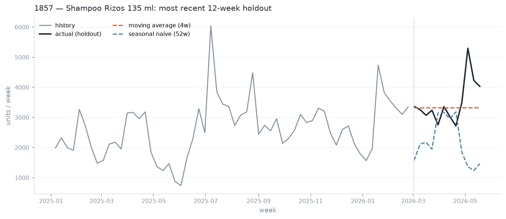
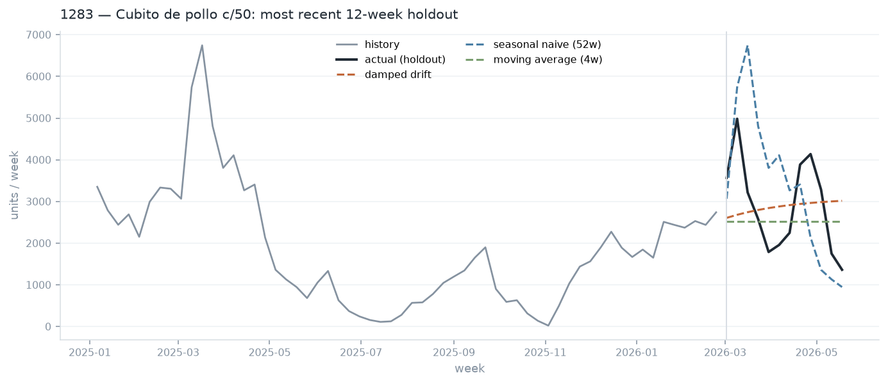
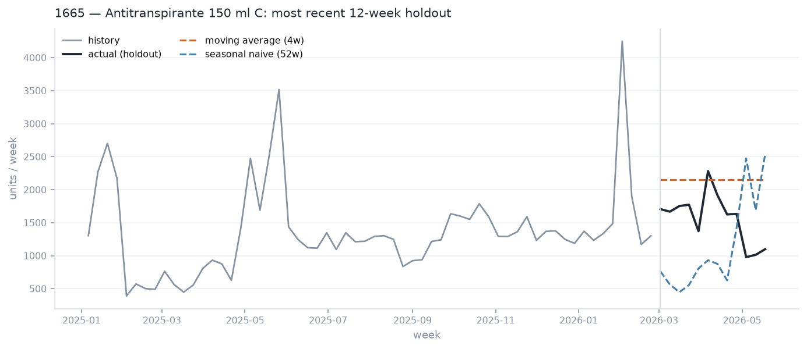

# Stage 03 — Demand forecasting (Challenge A)

> **Generated artifact — do not edit by hand.** Produced by `scripts/03_forecast.py`; re-run the script to regenerate.

Weekly unit demand for three SKUs, 12 weeks ahead, validated on 5 rolling origins with no future information available to any model.

| Run metadata | Value |
|---|---|
| Stage | `scripts/03_forecast.py` |
| Generated (UTC) | 2026-08-05 02:08:56 |
| Source file | `20260701_Prueba_tecnica_AI Engineer.csv` |
| Source SHA-256 | `a8a9b8a3d5c91955…` |
| Param · horizon | 12 |
| Param · origins | 5 |

## 1. How the models are validated

Every model sees only weeks 1…t and is scored on weeks t+1…t+12, for 5 different values of t spaced three weeks apart. Nothing in a model's input can be computed from the period it is being scored on.

- **naive (last week)** and **moving average (4w)** — the floor. A model that cannot beat these is not earning its complexity.
- **seasonal naive (52w)** — repeats the same week of last year. With ~1.4 years of history this is the only way an annual pattern can be used at all.
- **ETS (damped trend)** — exponential smoothing. Seasonality is deliberately switched off: a 52-week period needs two full cycles to estimate, and this history has 1.4.
- **harmonic ridge** — linear trend plus Fourier terms for the annual cycle, on log units. Deterministic in the future, so there is nothing to feed back recursively and no path for leakage.
- **damped drift** — recent level plus a geometrically damped continuation of the recent slope. Added after a first pass showed every level-only model under-forecasting by 13–30%: the series drift upward and a flat forecast cannot follow. Damping prevents that slope being extrapolated indefinitely.
- **ensemble (MA + drift + ETS)** — the mean of three forecasts that fail differently. The cheapest reliable improvement in forecasting practice, because no single component has to be right.

> **Why WAPE is the headline metric.** MAPE divides by each week's actual, so a quiet 20-unit week can contribute a 300% error and dominate the average, and it structurally rewards under-forecasting — an over-forecast's error is unbounded while an under-forecast caps at 100%. For replenishment, being short is at least as costly as being long, and cost is incurred per unit. WAPE weights every unit equally. MASE is reported alongside because it answers the stakeholder's actual question: is this better than doing nothing? Below 1.0 means yes.

## 2.1 SKU 1857 — Shampoo Rizos 135 ml

| Item | Value |
|---|---|
| Weeks of history | 72 |
| Median weekly units | 2,747 |
| Coefficient of variation | 0.341 |
| Median promo share | 0 |

Mean scores across 5 rolling origins, best WAPE first. `skill_vs_best_baseline` below 1.0 means the model beat every baseline:

| model | origins | WAPE | MAE | RMSE | MASE | bias | skill_vs_best_baseline |
|---|---|---|---|---|---|---|---|
| moving average (4w) | 5 | 0.2573 | 825.2 | 952.1 | 1.414 | -0.1312 | 1 |
| naive (last week) | 5 | 0.2754 | 876.5 | 1,032 | 1.499 | -0.1861 | 1.07 |
| ETS (damped trend) | 5 | 0.2797 | 893.6 | 1,022 | 1.527 | -0.1436 | 1.087 |
| ensemble (MA + drift + ETS) | 5 | 0.3084 | 988 | 1,108 | 1.687 | -0.1268 | 1.199 |
| harmonic ridge | 5 | 0.3117 | 1,015 | 1,145 | 1.725 | -0.2406 | 1.211 |
| seasonal naive (52w) | 5 | 0.3301 | 1,069 | 1,278 | 1.816 | -0.2448 | 1.283 |
| damped drift | 5 | 0.3939 | 1,263 | 1,380 | 2.151 | -0.1056 | 1.531 |

**No candidate beat the baselines.** `moving average (4w)` wins at WAPE 0.257, so that is what is used — the honest answer is that this series does not support anything more elaborate.

*1857 (Shampoo Rizos 135 ml): the final 12 weeks held out, with the selected model and two baselines. The vertical line is the forecast origin — everything to its right was unavailable to every model shown.*

## 2.2 SKU 1283 — Cubito de pollo c/50

| Item | Value |
|---|---|
| Weeks of history | 72 |
| Median weekly units | 1,869 |
| Coefficient of variation | 0.696 |
| Median promo share | 0.35 |

Mean scores across 5 rolling origins, best WAPE first. `skill_vs_best_baseline` below 1.0 means the model beat every baseline:

| model | origins | WAPE | MAE | RMSE | MASE | bias | skill_vs_best_baseline |
|---|---|---|---|---|---|---|---|
| damped drift | 5 | 0.272 | 749.4 | 922.7 | 1.764 | -0.1229 | 0.845 |
| ensemble (MA + drift + ETS) | 5 | 0.3107 | 838.9 | 1,056 | 1.966 | -0.2317 | 0.965 |
| naive (last week) | 5 | 0.3219 | 872.3 | 1,096 | 2.042 | -0.2484 | 1 |
| ETS (damped trend) | 5 | 0.3425 | 923.1 | 1,147 | 2.158 | -0.27 | 1.064 |
| moving average (4w) | 5 | 0.3575 | 949.4 | 1,181 | 2.214 | -0.3022 | 1.111 |
| seasonal naive (52w) | 5 | 0.4361 | 1,179 | 1,447 | 2.765 | 0.0116 | 1.355 |
| harmonic ridge | 5 | 0.4812 | 1,314 | 1,501 | 3.072 | 0.2162 | 1.495 |

**`damped drift` is selected**, at WAPE 0.272 against the best baseline's 0.322 — an improvement of 15.5%.

*1283 (Cubito de pollo c/50): the final 12 weeks held out, with the selected model and two baselines. The vertical line is the forecast origin — everything to its right was unavailable to every model shown.*

## 2.3 SKU 1665 — Antitranspirante 150 ml C

| Item | Value |
|---|---|
| Weeks of history | 72 |
| Median weekly units | 1,302 |
| Coefficient of variation | 0.459 |
| Median promo share | 0.925 |

Mean scores across 5 rolling origins, best WAPE first. `skill_vs_best_baseline` below 1.0 means the model beat every baseline:

| model | origins | WAPE | MAE | RMSE | MASE | bias | skill_vs_best_baseline |
|---|---|---|---|---|---|---|---|
| moving average (4w) | 5 | 0.2906 | 486.4 | 780.6 | 1.424 | -0.0146 | 1 |
| ensemble (MA + drift + ETS) | 5 | 0.3979 | 666.4 | 961.9 | 1.941 | 0.073 | 1.369 |
| damped drift | 5 | 0.4691 | 778 | 1,072 | 2.232 | 0.1103 | 1.614 |
| ETS (damped trend) | 5 | 0.475 | 799.5 | 1,087 | 2.337 | 0.1232 | 1.635 |
| seasonal naive (52w) | 5 | 0.481 | 811.3 | 1,074 | 2.376 | -0.3448 | 1.655 |
| naive (last week) | 5 | 0.5295 | 889.4 | 1,171 | 2.591 | 0.1092 | 1.822 |
| harmonic ridge | 5 | 0.5297 | 891.6 | 1,121 | 2.648 | -0.5059 | 1.823 |

**No candidate beat the baselines.** `moving average (4w)` wins at WAPE 0.291, so that is what is used — the honest answer is that this series does not support anything more elaborate.

*1665 (Antitranspirante 150 ml C): the final 12 weeks held out, with the selected model and two baselines. The vertical line is the forecast origin — everything to its right was unavailable to every model shown.*

## 3. Forward forecast

Each SKU's selected model, refit on the full history, projected 12 weeks beyond the last complete week (2026-05-18):

| week_start | 1283 | 1665 | 1857 |
|---|---|---|---|
| 2026-05-25 | 2,669 | 1,182 | 4,264 |
| 2026-06-01 | 2,699 | 1,182 | 4,264 |
| 2026-06-08 | 2,724 | 1,182 | 4,264 |
| 2026-06-15 | 2,745 | 1,182 | 4,264 |
| 2026-06-22 | 2,764 | 1,182 | 4,264 |
| 2026-06-29 | 2,779 | 1,182 | 4,264 |
| 2026-07-06 | 2,792 | 1,182 | 4,264 |
| 2026-07-13 | 2,804 | 1,182 | 4,264 |
| 2026-07-20 | 2,813 | 1,182 | 4,264 |
| 2026-07-27 | 2,821 | 1,182 | 4,264 |
| 2026-08-03 | 2,828 | 1,182 | 4,264 |
| 2026-08-10 | 2,834 | 1,182 | 4,264 |

| Item | Value |
|---|---|
| Total forecast units, 1857 | 51,168 |
| Total forecast units, 1283 | 33,272 |
| Total forecast units, 1665 | 14,184 |

## 4. What limits these numbers

- **17 months is not two seasons.** Any annual pattern is observed roughly once, so a seasonal model cannot separate a genuine yearly cycle from a one-off event. This is the binding constraint on SKU 1283, whose demand swings 26-fold between its trough and peak months.
- **Promotions are not in the model.** Promotional pressure drives a large share of weekly variation, but future promo plans are not in the dataset. Including a promo covariate would require assuming the plan is known — defensible in production, where trade marketing sets the calendar in advance, and leakage in a backtest. The forecast is therefore a demand expectation under a promotional pattern resembling the recent past.
- **Point forecasts, not intervals.** A replenishment decision needs a service level, which needs a distribution. Prediction intervals are the first thing to add with more time.
- **The last week may be soft.** Extracts often catch the final period mid-settlement; partial weeks are already excluded, but a systematically under-reported final week would bias every model's level downward.
- **Warehouse 11's shutdown sits inside the training window, not at its edge (F-013).** Every other warehouse sells through the last observed week; warehouse 11's ticket count tapers from 324/month in Jan 2025 to 9 in Aug 2025 and then to zero for the remaining ~9.5 months — an 8-month wind-down, not a data cut. These national SKU-week totals include that decline, so a model reading the taper alone would see it as demand collapsing rather than one warehouse exiting. Stage 06's warehouse allocation already excludes warehouse 11 from its share base for exactly this reason; the forecast above is at the national level and does not separate the two.
