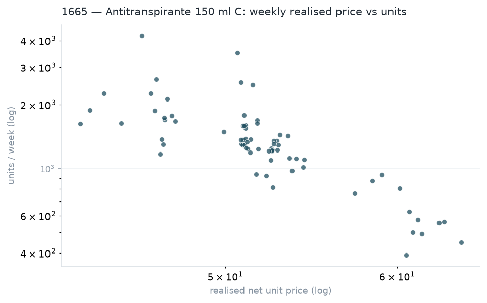
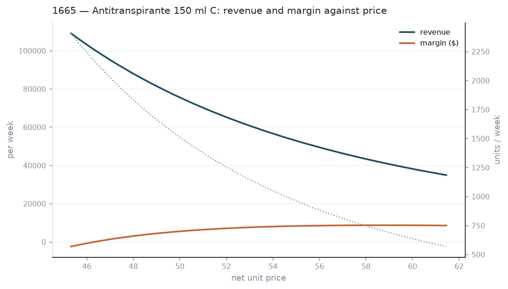

# Stage 04 — Price elasticity and simulator (Challenge B)

> **Generated artifact — do not edit by hand.** Produced by `scripts/04_elasticity.py`; re-run the script to regenerate.

SKU 1665 — Antitranspirante 150 ml C. Demand response to realised price, and a simulator bounded to the p5–p95 observed price band.

| Run metadata | Value |
|---|---|
| Stage | `scripts/04_elasticity.py` |
| Generated (UTC) | 2026-08-04 03:48:09 |
| Source file | `20260701_Prueba_tecnica_AI Engineer.csv` |
| Source SHA-256 | `a8a9b8a3d5c91955…` |
| Param · sku | 1665 |

## 1. Where the price variation comes from

SKU 1665 was selected on a criterion fixed before estimating: the widest observed price support, since that is exactly what bounds the simulator's valid domain. Two SKUs qualified (finding F-006); this one has the wider range and the larger volume.

| Item | Value |
|---|---|
| Weeks in the price panel | 72 |
| Realised price range | 42.87 – 64.20 |
| Median realised price | 51.55 |
| Median list price | 60.19 |
| Median promo share of units | 0.925 |

> **This matters more than the coefficient.** This SKU is on promotion in nearly every week of the history, so its price moves through changes in *discount depth*, not through list-price changes. What is estimated is therefore the response to realised price under promotion. That is the right input for a trade-promotion decision — the actual question being asked — but it is not evidence about how demand would respond to a permanent list-price change, and it should not be quoted as such.

## 2. Elasticity estimate

Log-log demand regression with a linear trend and annual Fourier terms, so the price coefficient is not absorbing seasonality or drift. Standard errors are Newey-West (HAC), because weekly demand is autocorrelated and plain OLS errors would report more confidence than the evidence supports.

| Item | Value |
|---|---|
| Price elasticity of demand | -4.734 |
| Standard error (HAC) | 0.498 |
| 95% confidence interval | [-5.709, -3.759] |
| p-value | 0.0000 |
| R² | 0.76 |
| Weeks used | 72 |

A 1% increase in realised price is associated with a 4.73% change in weekly units, in the opposite direction. Demand is elastic: a price cut raises revenue, because volume grows faster than price falls.

> **An elasticity near −5 is high for a household staple, and that is informative rather than suspicious.** This is *sell-in* — shipments to distributors, not purchases by shoppers. Distributors buy ahead when a discount is offered, so sell-in absorbs both genuine demand response and forward-buying, and it is routinely several times more elastic than sell-out. The practical reading: this number tells you how much distributors will load in when you discount. It does **not** tell you how many extra units reach consumers, and treating it as consumer demand would substantially overstate the benefit of a price cut.

*1665 (Antitranspirante 150 ml C): each point is one week. The downward slope on log-log axes is what a constant-elasticity model assumes; the visible scatter is the uncertainty the confidence interval quantifies.*

## 3. Unit economics used by the simulator

Margin cannot be read off the file: `product_margin` is absent and `product_cost` exceeds gross revenue on every row (findings F-001 and F-003, open question Q5). The adopted reading is stated here so every number below can be re-derived — or rejected — on its own terms.

| product_code | product_name | margin_rate | rows | in_documented_band |
|---|---|---|---|---|
| 1283 | Cubito de pollo c/50 | 0.24 | 118,944 | 1 |
| 1665 | Antitranspirante 150 ml C | 0.3 | 54,879 | 1 |
| 1857 | Shampoo Rizos 135 ml | 0.27 | 66,935 | 1 |
| 1858 | Shampoo 135 ml Azul | 0.26 | 45,725 | 1 |
| 1875 | Desodorante 150 ml A | 0.22 | 59,025 | 1 |
| 9304 | Shampoo 180ml Verde | 0.22 | 12,573 | 1 |

| Item | Value |
|---|---|
| Assumption | cost = bruto / (1 + margin), with margin = product_cost/bruto - 1 |
| Recovered margin rate for 1665 | 0.3 |
| List price anchor (median) | 60.19 |
| Implied unit cost | 46.3 |

> **Sensitivity to the assumption.** Taken literally, `product_cost` implies a unit cost of 78.25 against a median realised price of 51.55 — every price in the observed range would be loss-making and no pricing recommendation could be made at all. That the literal reading yields an impossible business is the argument for the correction, not a reason to hide it.

## 4. Simulator

### Price range with evidence behind it

The raw min and max of realised weekly price are not prices anyone set: the floor is free bonus product shipped inside a combo (a zero-revenue line still carrying units), and the ceiling is a handful of weeks where net exceeds gross and the implied discount is negative (F-004). Both tails are artefacts of how a combo reconciles, not evidence about a price the business would charge. The simulator is therefore bounded to the p5–p95 band of realised price instead, and it **refuses** to price outside that band — `predict_units` raises rather than extrapolating.

| product_code | product_name | weeks | raw_min | raw_max | band_p05 | band_p95 |
|---|---|---|---|---|---|---|
| 1283 | Cubito de pollo c/50 | 72 | 180.2 | 204.5 | 182.2 | 203.4 |
| 1665 | Antitranspirante 150 ml C | 72 | 42.87 | 64.2 | 45.32 | 61.45 |
| 1857 | Shampoo Rizos 135 ml | 72 | 18.34 | 20.98 | 19 | 20.89 |
| 1858 | Shampoo 135 ml Azul | 72 | 17.98 | 21 | 18.97 | 20.88 |
| 1875 | Desodorante 150 ml A | 72 | 42.95 | 64.93 | 45.44 | 61.57 |
| 9304 | Shampoo 180ml Verde | 72 | 15.24 | 17.34 | 15.72 | 17.29 |

> **SKU 1665, concretely.** The raw observed range was 42.87–64.20. The p5–p95 band used from here on is 45.32–61.45 — narrower at the top, because the raw ceiling was the artefact tail described above.

Expected weekly demand, revenue and margin across the observed price band (45.32 – 61.45), holding season and trend at their average. Every tenth grid point:

| price | units | revenue | margin_value | margin_pct | unit_cost |
|---|---|---|---|---|---|
| 45.32 | 2,407 | 1.091e+05 | -2,361 | -0.0216 | 46.3 |
| 46.96 | 2,034 | 9.554e+04 | 1,342 | 0.014 | 46.3 |
| 48.6 | 1,729 | 8.404e+04 | 3,977 | 0.0473 | 46.3 |
| 50.24 | 1,478 | 7.424e+04 | 5,822 | 0.0784 | 46.3 |
| 51.88 | 1,269 | 6.585e+04 | 7,083 | 0.1076 | 46.3 |
| 53.52 | 1,095 | 5.863e+04 | 7,909 | 0.1349 | 46.3 |
| 55.16 | 949.6 | 5.238e+04 | 8,413 | 0.1606 | 46.3 |
| 56.8 | 826.6 | 4.695e+04 | 8,679 | 0.1849 | 46.3 |
| 58.44 | 722.4 | 4.222e+04 | 8,770 | 0.2077 | 46.3 |
| 60.08 | 633.6 | 3.807e+04 | 8,732 | 0.2294 | 46.3 |

*1665 (Antitranspirante 150 ml C): revenue and margin in currency against realised unit price, with expected units on the right axis. Where the two curves peak at different prices is precisely the trade-off the commercial team has to settle.*

> **The simulator refuses to extrapolate.** Its grid is constructed from the p5–p95 observed price band and cannot be queried outside it. A constant-elasticity curve extended past the data is arithmetic, not evidence — and the further it goes, the more confident it looks.

## 5. Recommended price

| Item | Value |
|---|---|
| Revenue objective — NO interior optimum (see note below) | 45.32 (band edge, not an optimum) |
| Margin-maximising price | 58.71 |
| Balanced recommendation | 54.34 |
| Expected units/week at that price | 1,019 |
| Expected weekly revenue | 5.539e+04 |
| Expected weekly margin ($) | 8,196 |
| Expected margin (%) | 14.8 |

The balanced price maximises the average of revenue and margin, each normalised to its own maximum. The rule is stated rather than hidden so the commercial team can argue with the weighting instead of with a black box — if margin matters more this quarter, the margin-maximising price is the one to take.

> **The single most actionable number here is the break-even price: 46.41.** Below it, every additional unit sold loses money under the assumed cost of 46.30. 7 of the 72 weeks in the history — 10% — were priced below that line. The elastic demand is real, but the volume it buys at those prices is bought at a loss.

> **With demand this elastic, the revenue objective has no finite solution — not merely none inside the band.** Revenue = price × units, and under a constant-elasticity curve, revenue scales as price^(-3.734). At the fitted elasticity of -4.734 that exponent is negative, so revenue falls monotonically as price rises across the **entire positive price domain**, not just past the band. There is no interior maximum anywhere to miss. The figure 45.32 above is nothing but wherever the grid's lower edge happens to sit — it would move to any other lower edge chosen, and it is not evidence of an optimal price. The margin curve is different: it has a genuine interior maximum at 58.71, comfortably inside the band, which is why the recommendation is built on margin, not revenue.

> **The balanced price is measurably pulled toward the band floor by this degenerate revenue term.** Because normalised revenue decreases monotonically across the band, it always votes for the cheapest price in the grid, regardless of what the margin curve looks like. Balanced price with the revenue term included: 54.34. Balanced price with the revenue term dropped — equivalent to optimising on margin alone, since normalising and averaging do not move an argmax: 58.71. That is a pull of 4.37 toward the floor, entirely attributable to a term chasing a boundary artefact rather than a genuine revenue/margin trade-off. This is disclosed rather than fixed here: changing the balanced-price rule to drop or reweight the revenue term is a decision for the case owner, not something this stage should do silently.

## 6. Break-even discount by SKU

The break-even price above is specific to a single SKU and a single list-price anchor. The same identity — cost = list / (1 + margin), so price equals cost at a discount depth of margin / (1 + margin) — restated as a *depth* generalises to all six SKUs and is directly comparable across them, even though their list prices differ by an order of magnitude.

**This must be compared against the actual promotional discount, not against the weekly panel's `discount_depth`.** That panel field is a bruto-vs-net proxy (1 − avg net price / avg list price), and it is blind to combo-level discounts that never reach `bruto` line by line — the reconciliation defect finding F-004 documents. `discount` is the field the data dictionary defines as the promotional depth, so the comparison below uses it directly: unit-weighted, over promoted lines with a trustworthy `discount` — excluding zero-quantity, missing-cost/revenue and negative-`discount` rows (F-004, open question Q6), but **keeping** zero-amount free-goods lines, since a 100%-discount giveaway is a legitimate, informative promotional-depth observation, not a data problem, and dropping it would understate exactly the SKUs that lean most on bonus volume. The table makes the panel's disagreement with this measure visible rather than asserting it — for SKUs 9304, 1857 and 1858 the panel proxy reads roughly a tenth of the discount that `discount` itself records, because their combos apply the cut at a level the proxy cannot see.

**One SKU's figure rests partly on an imputation, and that is disclosed here rather than left to the source.** `mean_promo_discount` treats a null `discount` as zero rather than dropping the row. For SKU 1283, 29.07% of promoted-line units carry a null `discount` — negligible for every other SKU — so its figure below is the most exposed to that convention.

| product_code | product_name | margin_rate | break_even_discount | mean_promo_discount | bruto_proxy_discount_depth | null_discount_unit_share | cushion | already_below_cost |
|---|---|---|---|---|---|---|---|---|
| 9304 | Shampoo 180ml Verde | 0.22 | 0.1803 | 0.2129 | 0.0174 | 0 | -0.0326 | 1 |
| 1875 | Desodorante 150 ml A | 0.22 | 0.1803 | 0.1735 | 0.1297 | 0.08 | 0.0068 | 0 |
| 1283 | Cubito de pollo c/50 | 0.24 | 0.1935 | 0.0714 | 0.0342 | 29.07 | 0.1221 | 0 |
| 1858 | Shampoo 135 ml Azul | 0.26 | 0.2063 | 0.224 | 0.0134 | 0 | -0.0177 | 1 |
| 1857 | Shampoo Rizos 135 ml | 0.27 | 0.2126 | 0.2235 | 0.0135 | 0 | -0.0109 | 1 |
| 1665 | Antitranspirante 150 ml C | 0.3 | 0.2308 | 0.1774 | 0.1305 | 0 | 0.0534 | 0 |

> **9304 (Shampoo 180ml Verde), 1858 (Shampoo 135 ml Azul), 1857 (Shampoo Rizos 135 ml) already sell under cost on the typical promoted line, not just in isolated deep-discount episodes.** For these SKUs, the unit-weighted mean promotional discount exceeds the break-even depth, so the erosion is a standing loss built into the ordinary promotional cadence — not an occasional dip that a few unusually deep weeks explain away.

> **1875 (Desodorante 150 ml A, cushion 0.68%) is a close call, not a comfortable no.** Its cushion is within two points of the break-even depth, and the underlying figure has moved by roughly a point across review rounds purely from filtering questions unrelated to the discount itself (which rows count as price-usable). A cushion this thin should be treated as marginal — worth re-checking before it is relied on for a repeat-or-drop call — not as safely clear of cost.

## 7. Risks and assumptions

- **Promotional confound.** Price variation comes from discount depth on an almost-always-promoted SKU. The estimate is a promotional price response, not a structural list-price elasticity.
- **Reconstructed margin.** Every margin figure rests on `cost = list / (1 + 0.3)`. If VEMIO answers Q5 differently, the revenue column survives unchanged and the margin column does not.
- **Constant elasticity is an approximation.** A single coefficient assumes the same percentage response at every price. Over a range this wide the true curve almost certainly bends; the estimate is most trustworthy near the middle of the observed range, which is where the recommendation sits.
- **Weekly aggregation hides mix.** A week's realised price averages across warehouses, clients and combo structures. Two weeks with the same average price can have very different underlying offers.
- **No competitor or stock data.** Demand shifts caused by rival pricing or out-of-stock weeks are absorbed into the residual, which widens the interval and could bias the coefficient if either correlates with discount timing.
- **72 weekly observations.** Enough for one coefficient with honest error bars, not enough for interaction effects or a flexible functional form.
